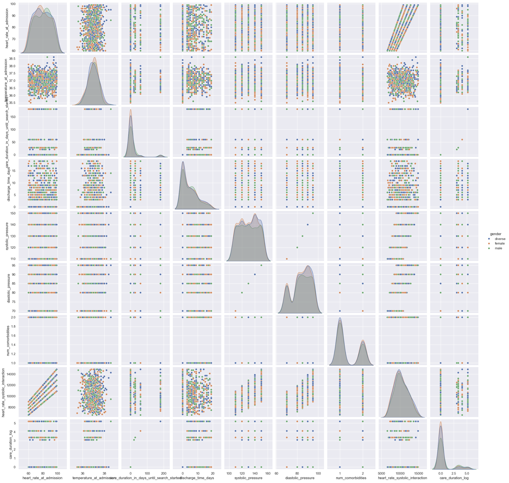

# Medical Dataset Preprocessing, Feature Engineering, and Model Training

This project focuses on the preprocessing, feature engineering, exploratory data analysis (EDA), and model training using a [medical dataset](https://www.kaggle.com/datasets/hospital-discharge). The aim is to predict patient discharge times based on various health and demographic features using Python libraries such as `pandas`, `scikit-learn`, and `xgboost`.



## Table of Contents

- [Installation](#installation)
- [Dataset Overview](#dataset-overview)
- [Preprocessing Strategy](#preprocessing-strategy)
- [Feature Engineering Approach](#feature-engineering-approach)
- [Model Training Pipeline](#model-training-pipeline)
- [Usage Guidelines](#usage-guidelines)

## Installation

Ensure Python 3.7 or above is installed. Required libraries can be installed using:

```bash
pip install pandas seaborn matplotlib xgboost scikit-learn shap lime
```

## Dataset Overview
The dataset contains information about patient health conditions, vital signs, and care requirements at the time of admission.

## Preprocessing Strategy
The preprocessing phase aims to clean and transform the dataset to prepare it for analysis and modeling. The key steps include:

- Handling Missing Data: Filling missing values based on domain knowledge or common imputation methods.
- Dropping Irrelevant Features: Removing columns that do not contribute to the predictive analysis (e.g., patient ID).
- Categorical Encoding: Transforming categorical variables into numerical formats suitable for modeling.
- Feature Engineering Approach

## Feature engineering is a crucial aspect of this project, aimed at extracting and creating meaningful variables to enhance the predictive power of the model:

Health Indicators: Extracting components from complex health metrics (e.g., separating systolic and diastolic blood pressure).
Binning Continuous Variables: Categorizing continuous metrics like heart rate into logical bins (e.g., low, normal, high).
Interaction Features: Creating interaction terms between health metrics to capture their combined effect on the outcome.
Log Transformations: Applying transformations to normalize skewed data distributions.

## Model Training Pipeline
The model training is conducted using the XGBoost algorithm, a powerful gradient boosting technique. The pipeline includes:

- Data Splitting: Dividing the dataset into training and test sets for unbiased performance evaluation.
- Hyperparameter Tuning: Using grid search cross-validation (GridSearchCV) to optimize model parameters for better accuracy.
- Performance Evaluation: Assessing the model using appropriate metrics (e.g., mean absolute error) to ensure robustness.

## Usage Guidelines
- Clone the Repository: Clone this project repository locally.
- Install Dependencies: Ensure all necessary libraries are installed using the pip install command or requirements.txt.
- Run the Preprocessing Pipeline: Execute the preprocessing script to clean and prepare the dataset.
- Model Training: Run the training script to build and evaluate the model. Hyperparameters and configurations can be adjusted as needed.

## Project Goals and Scope
The primary goal is to accurately predict the patient discharge time using the available health and demographic data. This involves:

- Ensuring Data Quality: Comprehensive preprocessing to handle missing and noisy data.
- Enhanced Feature Selection: Utilizing domain knowledge to engineer features that capture important health trends.
- Model Optimization: Applying advanced machine learning techniques for performance improvement.

## Contributions and Feedback
Contributions to improve or expand the functionality of this project are welcome. Please open an issue or submit a pull request with any suggestions or enhancements.